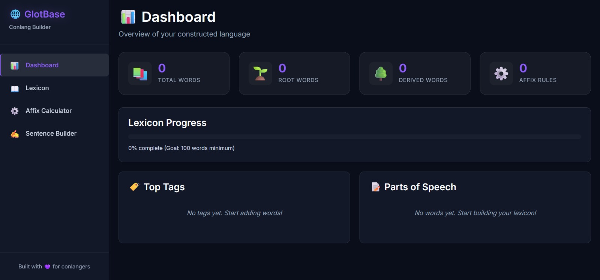
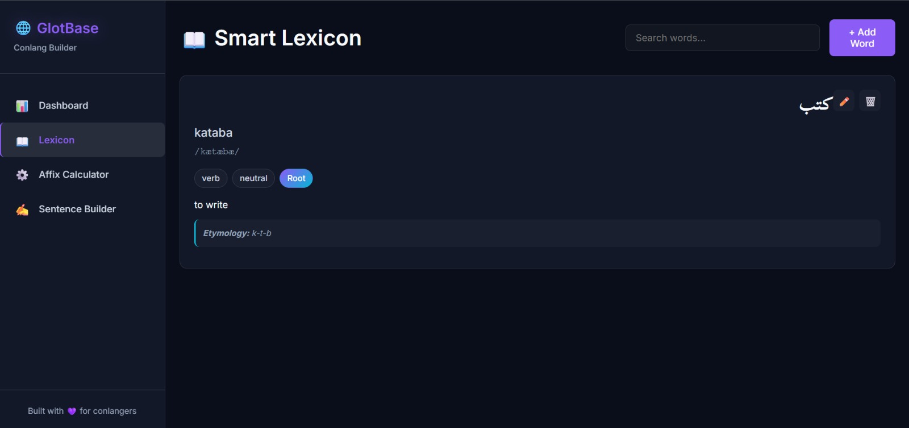
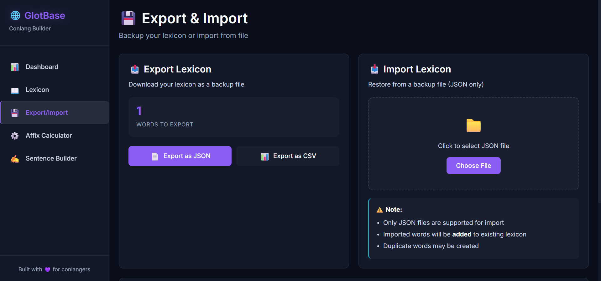

# GlotBase - Conlang Archive & Builder

**GlotBase** is a modern web application for building and documenting constructed languages (conlangs). Designed specifically to accommodate complex language systems with various writing systems, word orders, and gender systems.


---

## ✨ Features

### 📊 Dashboard
- **Real-time Statistics** - Total words, root vs derived words, affix rules count
- **Progress Tracking** - Visual progress bar for lexicon completion
- **Analytics** - Parts of speech distribution, tag analysis
- **Recent Activity** - List of recently added words

### 📖 Smart Lexicon
- **Multi-Script Support** - Jawi, Arabic, Tengwar, or any custom script
- **RTL Support** - Right-to-left rendering for Arabic-based scripts
- **Comprehensive Word Data**:
  - Native Script (any writing system)
  - Romanization (Latin transliteration)
  - IPA (International Phonetic Alphabet)
  - Part of Speech (10 categories)
  - Gender System (Neutral, Masculine, Feminine, Divine, or Custom)
  - Etymology tracking
  - Tag system for categorization
  - Root word indicator
- **CRUD Operations** - Create, Read, Update, Delete
- **Search Functionality** - Search by romanization, definition, native script

### ⚙️ Affix Calculator
- **Rule Management** - Create morphological rules (prefix, suffix, infix, circumfix)
- **Auto-Generation** - Automatically generate derived words from root words
- **Preview System** - Preview results before generating
- **Batch Processing** - Apply multiple rules at once
- **Perfect for Austronesian Languages** - Handles complex affixation patterns

### 💾 Export/Import
- **JSON Export** - Full backup with all metadata
- **CSV Export** - Spreadsheet-compatible format (Excel, Google Sheets)
- **JSON Import** - Restore from backup files
- **Timestamped Files** - Automatic file naming with timestamps

### 🎨 Modern Design
- **Dark Theme** - Premium dark mode with glassmorphism effects
- **Responsive** - Mobile, tablet, desktop friendly
- **Smooth Animations** - Hover effects and transitions
- **Premium Typography** - Inter for UI, Scheherazade New for Arabic/Jawi

### 💾 Data Persistence
- **LocalStorage** - Automatic browser-based storage
- **Type-Safe** - TypeScript for data integrity
- **Real-time Updates** - Statistics update automatically

---

## 🚀 Quick Start

### Prerequisites
- Node.js 18+ 
- npm or yarn

### Installation

```bash
# Clone the repository
git clone https://github.com/yourusername/glotbase.git
cd glotbase

# Install dependencies
npm install

# Start development server
npm run dev

# Open browser
http://localhost:5173
```

### Build for Production

```bash
# Build optimized bundle
npm run build

# Preview production build
npm run preview
```

---

## 📚 Usage Guide

### Adding Your First Word

1. Navigate to **Lexicon** in sidebar
2. Click **+ Add Word**
3. Fill in the form:
   - **Native Script**: Enter in your conlang's writing system (Jawi, Tengwar, etc.)
   - **Romanization**: Latin transliteration
   - **IPA**: Phonetic transcription (optional)
   - **Part of Speech**: Select from dropdown
   - **Gender**: Choose Neutral, Masculine, Feminine, Divine, or Custom
   - **Etymology**: Track word origins
   - **Definition**: Meaning of the word
   - **Tags**: Categorize (e.g., basic, nature, political)
4. Click **Add Word**

### Creating Affix Rules

1. Go to **Affix Calculator**
2. Click **+ Add Rule**
3. Define your rule:
   - **Name**: e.g., "Nominalizer -an"
   - **Type**: Prefix, Suffix, Infix, or Circumfix
   - **Pattern**: Use `$ROOT` as placeholder
     - Prefix: `me-$ROOT`
     - Suffix: `$ROOT-an`
     - Circumfix: `ke-$ROOT-an`
   - **Example**: "makan → makanan"
4. Click **Add Rule**

### Generating Derived Words

1. Select a **root word** from dropdown
2. Check the **affix rules** to apply
3. Preview the results
4. Click **Generate** - words are automatically added to lexicon!

### Custom Gender System

If your conlang has unique genders (e.g., animate/inanimate, celestial/terrestrial):
1. Select **Gender** → **Custom (specify below)**
2. Enter your custom gender name (e.g., "animate", "celestial")
3. The custom gender will be saved with the word

### Exporting Your Lexicon

1. Navigate to **Export/Import**
2. Click **Export as JSON** for full backup
3. Click **Export as CSV** for spreadsheet editing
4. Files are automatically named with timestamps

---

## 🏗️ Technology Stack

- **Frontend**: React 18 + TypeScript
- **Build Tool**: Vite 6
- **Styling**: Vanilla CSS with CSS Custom Properties
- **State Management**: React Context API
- **Data Storage**: LocalStorage (browser-based)

---

## 📁 Project Structure

```
glotbase/
├── public/
│   └── vite.svg
├── src/
│   ├── components/
│   │   ├── Dashboard.tsx          # Statistics dashboard
│   │   ├── Dashboard.css
│   │   ├── SmartLexicon.tsx       # Lexicon manager
│   │   ├── SmartLexicon.css
│   │   ├── AffixCalculator.tsx    # Affix rule engine
│   │   ├── AffixCalculator.css
│   │   ├── ExportImport.tsx       # Backup system
│   │   └── ExportImport.css
│   ├── context/
│   │   ├── LexiconContext.tsx     # Word state management
│   │   └── AffixContext.tsx       # Affix rules state
│   ├── types/
│   │   └── schema.ts              # TypeScript definitions
│   ├── utils/
│   │   ├── storage.ts             # LocalStorage wrapper
│   │   ├── affixEngine.ts         # Morphology engine
│   │   ├── syntaxValidator.ts     # Word order validation
│   │   ├── ipaHelper.ts           # IPA utilities
│   │   └── exportImport.ts        # File I/O operations
│   ├── App.tsx                    # Main app component
│   ├── App.css
│   ├── main.tsx                   # Entry point
│   └── index.css                  # Global styles
├── index.html
├── package.json
├── tsconfig.json
└── vite.config.ts
```

---

## 🎯 Gender System Options

GlotBase supports flexible gender systems:

| Gender | Description | Use Case |
|--------|-------------|----------|
| **Neutral** | No gender distinction | English-like systems |
| **Masculine** | Masculine gender | Romance, Germanic languages |
| **Feminine** | Feminine gender | Romance, Germanic languages |
| **Divine** | Sacred/holy entities | Religious or mythological terms |
| **Custom** | User-defined | Animate/inanimate, celestial/terrestrial, etc. |

---

## 🌍 Supported Writing Systems

GlotBase is **script-agnostic** and supports any writing system:

- ✅ **Jawi** (Arabic script for Malay)
- ✅ **Arabic** 
- ✅ **Tengwar** (Tolkien's Elvish)
- ✅ **Hangul** (Korean)
- ✅ **Katakana/Hiragana** (Japanese)
- ✅ **Cyrillic**
- ✅ **Devanagari**
- ✅ **Custom scripts** (your invented writing systems)

All RTL (right-to-left) scripts are automatically supported.

---

## 🔮 Roadmap

### Current Features (v1.0)
- ✅ Dashboard with real-time statistics
- ✅ Smart Lexicon with multi-script support
- ✅ Affix Calculator for word generation
- ✅ Export/Import (JSON & CSV)
- ✅ Custom gender systems

### Planned Features

#### Phase 2
- [ ] **Sentence Builder** - VSO/SVO/SOV word order testing
- [ ] **IPA Virtual Keyboard** - Click-to-insert IPA symbols

#### Phase 3
- [ ] **Phonology Editor** - Vowel/consonant inventory management
- [ ] **Grammar Wiki** - Document grammar rules with markdown
- [ ] **Corpus Manager** - Store example sentences and texts

#### Phase 4
- [ ] **PDF Export** - Print-ready dictionary format
- [ ] **Multi-language UI** - Interface localization
- [ ] **Cloud Sync** - Optional cloud backup

---

## 💡 Use Cases

### Perfect For:

1. **Austronesian-Inspired Languages**
   - Complex affixation systems (prefix, suffix, infix, circumfix)
   - VSO word order support (coming soon)
   - Jawi/Arabic script support

2. **Tolkien-Style Conlangs**
   - Tengwar or custom script support
   - Etymology tracking
   - Root/derived word system

3. **D&D Campaign Languages**
   - Quick word generation
   - Tag system for magic, divine, nature terms
   - Export to share with players

4. **Academic Linguistics**
   - IPA transcription support
   - Morphology documentation
   - Part of speech tracking

---

## 🤝 Contributing

Contributions are welcome! Areas for contribution:
- Additional Part of Speech categories
- More phonology tools
- Grammar documentation templates
- Export/import formats
- UI translations

### Development Setup

```bash
# Fork and clone the repo
git clone https://github.com/yourusername/glotbase.git
cd glotbase

# Install dependencies
npm install

# Start dev server
npm run dev

# Make your changes and create a PR
```

---

## 📄 License

This project is open source and available for personal or educational use. Feel free to fork and customize for your conlang needs!

---

## 🙏 Acknowledgments

Built with 💜 for conlangers worldwide

**Fonts:**
- [Inter](https://rsms.me/inter/) by Rasmus Andersson
- [Scheherazade New](https://software.sil.org/scheherazade/) by SIL International

**Inspiration:**
- PolyGlot
- Lexique Pro
- The conlanging community

---

## 📞 Support

For questions, issues, or feature requests:
- Open an [Issue](https://github.com/yourusername/glotbase/issues)
- Start a [Discussion](https://github.com/yourusername/glotbase/discussions)

---

**Happy Conlanging!** 🌐✨

---

## 📸 Screenshots

### Dashboard

*Real-time statistics and progress tracking*

### Smart Lexicon

*Multi-script word entry with comprehensive fields*

### Affix Calculator

*Automatic word derivation engine*

### Export/Import

*Backup and restore your lexicon*

---

## 🌟 Star History

If you find GlotBase useful, please consider giving it a star! ⭐

---

**Made with love for conlangers, by conlangers.**

