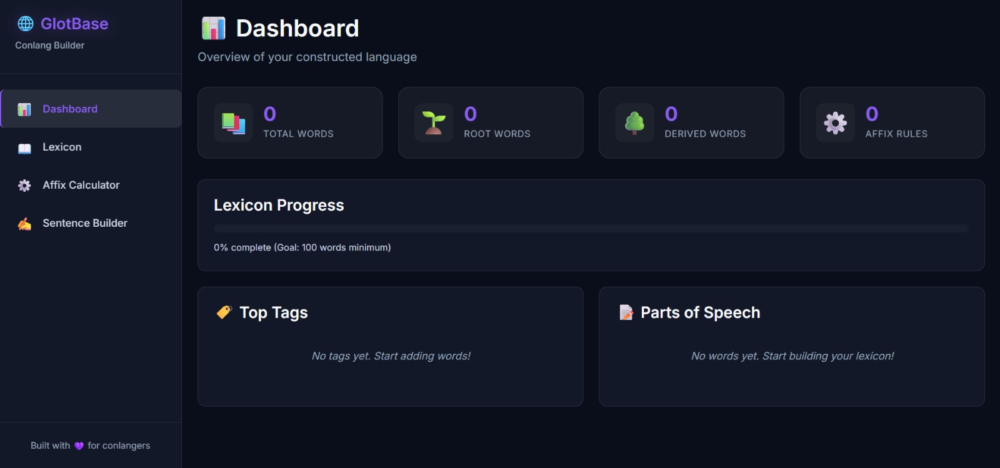
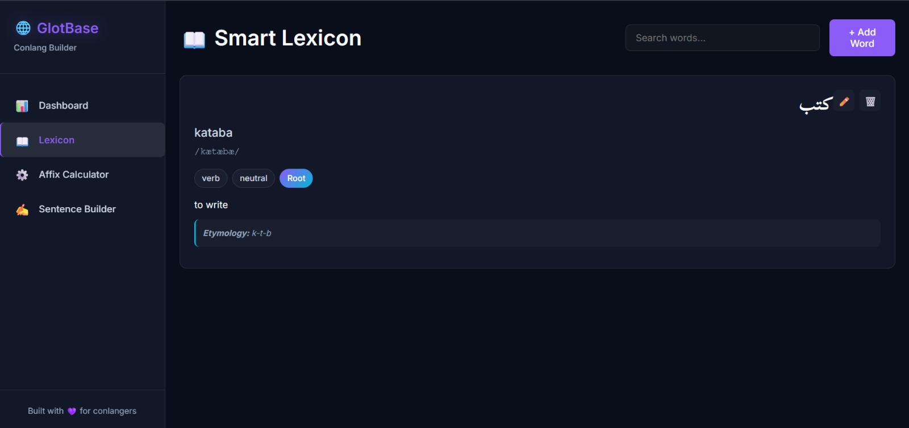
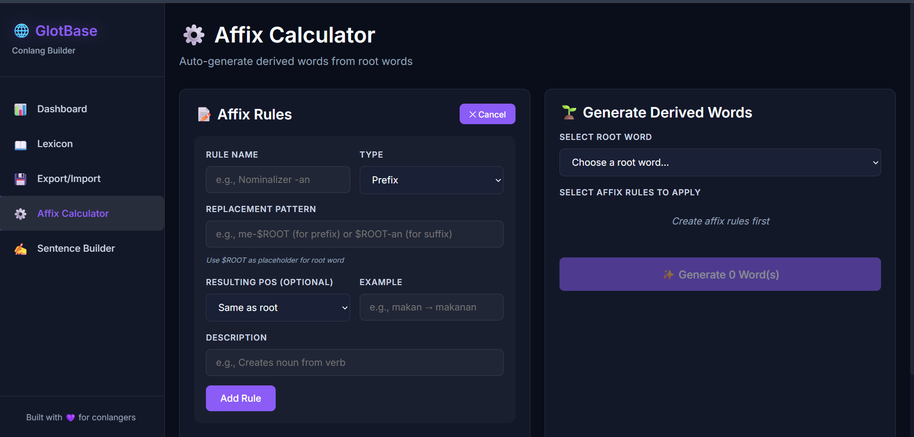

# GlotBase - Conlang Builder & Archive

**GlotBase** is a modern web application for building and documenting constructed languages (conlangs). Designed specifically to accommodate complex language systems with multi-script support, flexible word orders, and advanced morphology.


---

## ✨ Key Features

### 📊 **Dashboard**
Real-time statistics, progress tracking, and analytics for your conlang development.

### 📖 **Smart Lexicon**
- **Multi-Script Support** - Jawi, Arabic, Tengwar, or any custom writing system
- **RTL Support** - Automatic right-to-left rendering
- **Comprehensive Fields** - Native script, romanization, IPA, etymology, gender, tags
- **IPA Virtual Keyboard** - Click-to-insert vowels, consonants, diacritics, and tone marks
- **Custom Gender System** - Neutral, Masculine, Feminine, Divine, or user-defined
- **Full CRUD** - Create, read, update, delete with search

### ⚙️ **Affix Calculator**
- **Rule Management** - Full CRUD for morphological rules (prefix, suffix, infix, circumfix)
- **Auto-Generation** - Generate derived words from root words
- **Native Script Support** ⭐ - Automatically generates Jawi/Arabic script for derived words
- **Preview System** - See results before generating
- **Perfect for Austronesian Languages** - Complex affixation support

### ✍️ **Sentence Builder**
- **Universal Word Order** ⭐ - Validates all 6 patterns:
  - **VSO** (Verb-Subject-Object) - Welsh, Arabic
  - **SVO** (Subject-Verb-Object) - English, Mandarin
  - **SOV** (Subject-Object-Verb) - Japanese, Korean
  - **VOS, OVS, OSV** - Rare patterns supported
- **Real-time Validation** - Visual feedback for sentence structure
- **Pattern Visualization** - See your sentence's word order pattern
- **Sentence History** - Save and reference valid sentences

### 💾 **Export/Import**
- **JSON Export** - Full backup with all metadata
- **CSV Export** - Spreadsheet-compatible (Excel, Google Sheets)
- **JSON Import** - Restore from backups
- **Auto-naming** - Timestamped file names

### 🎨 **Modern Design**
- **Premium Dark Theme** - Glassmorphism effects
- **Fully Responsive** - Mobile, tablet, desktop
- **Smooth Animations** - Polished UX
- **Quality Typography** - Inter (UI), Scheherazade New (Arabic/Jawi)

---

## 🚀 Quick Start

### Prerequisites
- Node.js 18+
- npm or yarn

### Installation

```bash
# Clone the repository
git clone https://github.com/yourusername/glotbase.git
cd glotbase

# Install dependencies
npm install

# Start development server
npm run dev

# Open in browser
http://localhost:5173
```

### Build for Production

```bash
npm run build
npm run preview
```

---

## ✏️ Usage Guide

### 1. Adding Words

Navigate to **Lexicon** → **+ Add Word**:
- **Native Script**: Your conlang's writing system (Jawi, Tengwar, etc.)
- **Romanization**: Latin transliteration
- **IPA**: Phonetic transcription (optional)
- **Part of Speech**: Noun, verb, adjective, etc.
- **Gender**: Neutral, Masculine, Feminine, Divine, or Custom
- **Etymology**: Track word origins
- **Tags**: Categorize (basic, nature, divine, etc.)

### 2. Creating Affix Rules

Go to **Affix Calculator** → **+ Add Rule**:
- **Name**: e.g., "Nominalizer -an"
- **Type**: Prefix, Suffix, Infix, or Circumfix
- **Pattern**: Use `$ROOT` as placeholder
  - Prefix: `me-$ROOT`
  - Suffix: `$ROOT-an`
  - Circumfix: `ke-$ROOT-an`
- **Example**: makan → makanan

**New!** Native script auto-generation:
```
Root: makan (ماكن)
+ Suffix "-an"
= makanan (ماكنan)
```

### 3. Generating Derived Words

1. Select a root word
2. Check affix rules to apply
3. Preview results (shows romanization + native script)
4. Click **Generate** - derived words auto-added to lexicon!

### 4. Testing Word Order

Go to **Sentence Builder**:
1. Select your word order (VSO, SVO, SOV, etc.)
2. Add word slots
3. Fill with words from your lexicon
4. See real-time validation and pattern visualization
5. Save valid sentences to history

---

## 🏗️ Technology Stack

| Layer | Technology |
|-------|-----------|
| **Frontend** | React 18 + TypeScript |
| **Build Tool** | Vite 6 |
| **Styling** | Vanilla CSS + Custom Properties |
| **State** | React Context API |
| **Storage** | LocalStorage (browser-based) |

---

## 📁 Project Structure

```
glotbase/
├── src/
│   ├── components/
│   │   ├── Dashboard.tsx         # Statistics & analytics
│   │   ├── SmartLexicon.tsx      # Lexicon manager
│   │   ├── AffixCalculator.tsx   # Morphology engine
│   │   ├── SentenceBuilder.tsx   # Word order validator
│   │   └── ExportImport.tsx      # Backup system
│   ├── context/
│   │   ├── LexiconContext.tsx    # Word state
│   │   └── AffixContext.tsx      # Affix rules state
│   ├── utils/
│   │   ├── affixEngine.ts        # Native script generation
│   │   ├── syntaxValidator.ts    # Multi-pattern validation
│   │   ├── exportImport.ts       # File I/O
│   │   └── storage.ts            # LocalStorage wrapper
│   ├── types/
│   │   └── schema.ts             # TypeScript definitions
│   └── index.css                 # Global styles & design system
├── package.json
├── tsconfig.json
└── vite.config.ts
```

---

## 🌍 Supported Writing Systems

GlotBase is **script-agnostic** and supports any writing system:

✅ Jawi (Arabic-Malay)
✅ Arabic
✅ Tengwar (Elvish)
✅ Hangul (Korean)
✅ Katakana/Hiragana (Japanese)
✅ Cyrillic
✅ Devanagari
✅ Custom invented scripts

All RTL (right-to-left) scripts automatically supported.

---

## 💡 Perfect For

### Austronesian-Inspired Languages
- ✅ Complex affixation (prefix, suffix, infix, circumfix)
- ✅ VSO word order validation
- ✅ Jawi/Arabic script with auto-generation
- ✅ Divine gender for sacred terminology

### Tolkien-Style Conlangs
- ✅ Tengwar or custom scripts
- ✅ Etymology tracking
- ✅ Root/derived word system

### D&D Campaign Languages
- ✅ Quick word generation
- ✅ Tag system (magic, divine, nature)
- ✅ Export to share with players

### Academic Linguistics
- ✅ IPA transcription
- ✅ Morphology documentation
- ✅ Multi-pattern syntax testing

---

##🔮 Roadmap

### ✅ Completed (v2.1)
- Dashboard with real-time stats
- Smart Lexicon (multi-script, CRUD, search)
- Affix Calculator with native script generation
- Sentence Builder (all 6 word orders)
- Export/Import (JSON & CSV)
- Custom gender systems
- Edit rules functionality

### 🚧 Planned (v3.0)
- **Grammar Wiki** - Markdown documentation
- **Phonology Editor** - Sound inventory management
- **Batch Generation** - Multiple root words at once
- **Rule Categories** - Organize rules by function

### 🔮 Future (v4.0+)
- PDF dictionary export
- Cloud sync (optional)
- Multi-language UI
- Corpus manager

---

## 🤝 Contributing

Contributions welcome! Areas for contribution:
- Additional POS categories
- Phonology tools
- Grammar templates
- Export formats
- UI translations

```bash
# Fork and clone
git clone https://github.com/yourusername/glotbase.git
cd glotbase

# Install and develop
npm install
npm run dev

# Create a PR!
```

---

## 📄 License

Open source for personal and educational use. Fork and customize for your conlang needs!

---

## 🙏 Acknowledgments

Built with 💜 for conlangers worldwide

**Fonts:**
- [Inter](https://rsms.me/inter/) by Rasmus Andersson
- [Scheherazade New](https://software.sil.org/scheherazade/) by SIL International

**Inspiration:**
- PolyGlot, Lexique Pro
- The conlanging community

---

## 📸 Screenshots

### Dashboard

*Real-time statistics and progress tracking*

### Smart Lexicon

*Multi-script word entry*

### Affix Calculator

*Auto-generate derived words with native script*

### Sentence Builder

*Universal word order validation*

---

## 📞 Support

- 🐛 [Report Issues](https://github.com/yourusername/glotbase/issues)
- 💬 [Start Discussion](https://github.com/yourusername/glotbase/discussions)

---

**Happy Conlanging!** 🌐✨

⭐ If you find GlotBase useful, please consider starring the repo!

---

*Made with love for conlangers, by conlangers.*
